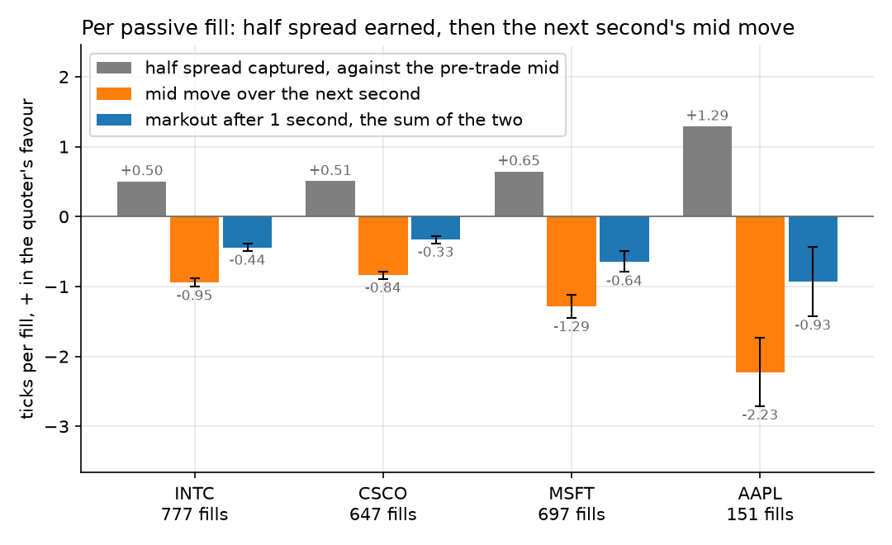
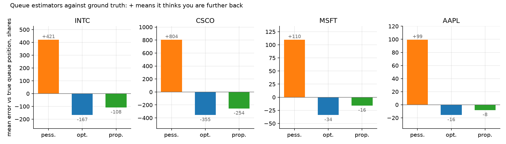
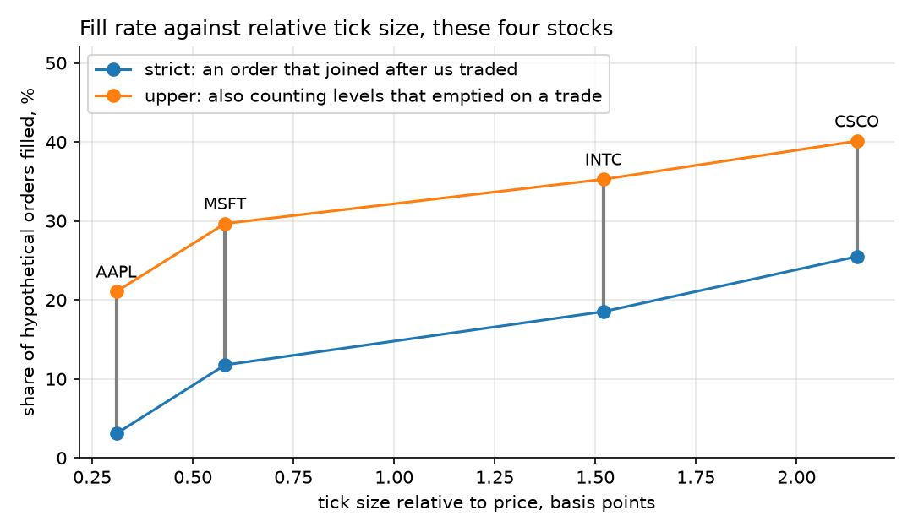
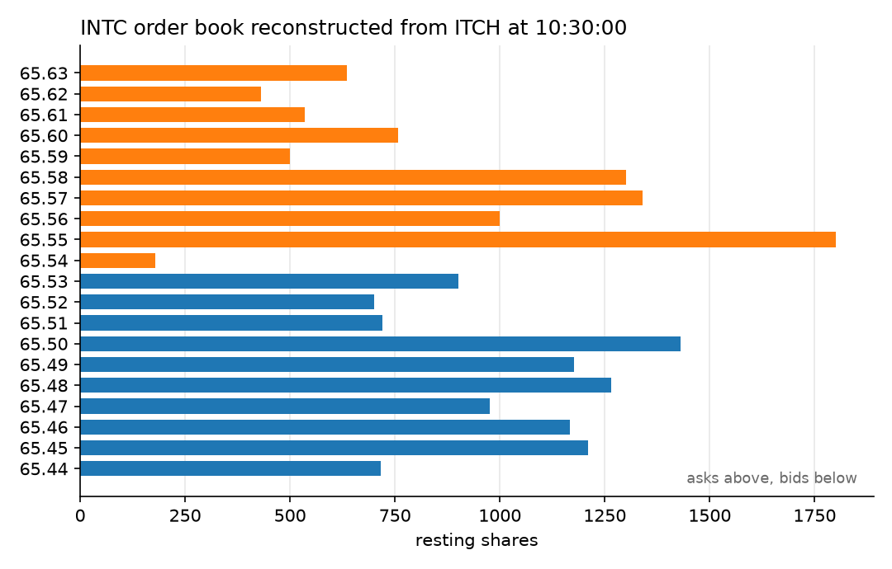

# itch-queue-position
When you post an order to buy a stock at the best bid, it joins a queue behind everyone already waiting at that price. I rebuild Nasdaq's order book from its raw feed for four stocks over one morning, slip imaginary orders into those queues, and measure how often they fill and whether the fills make money.

---

## Summary

  - Parses raw Nasdaq TotalView-ITCH 5.0 binary in pure Python and rebuilds the book order by order, so the true queue in front of any displayed order is known.
  - Places a hypothetical 100-share order at Nasdaq's best bid and offer every 300 messages per stock, follows it until it fills, is outbid, is left alone at its price or waits 60 seconds, and marks each fill against the mid 1 and 10 seconds later.
  - Scores three rules for guessing queue position from a feed that only shows total size at each price.
  - On a simulated ITCH session written by `src/synth.py`, the rebuilt book matches the generator's own book order for order ([`results/synthetic/results.txt`](results/synthetic/results.txt)).

---

## Example Results
Nasdaq, 30 January 2020, 04:00 to 12:28 (the first 2.7 GB of that day's file): 3,148,600 messages for these four stocks, zero crossed books in 3,124,010 checks. From [`results/results.txt`](results/results.txt):

```
summary                        INTC     CSCO     MSFT     AAPL
tick, bp of price              1.52     2.15     0.58     0.31
hypothetical orders            4196     2538     5922     4895
filled, strict                18.5%    25.5%    11.8%     3.1%
filled, upper bound           35.3%    40.1%    29.7%    21.1%
strict fills maybe partial      30%      31%      48%      57%
markout after 1s, ticks      -0.441   -0.332   -0.641   -0.934
  standard error              0.029    0.026    0.078    0.252
pessimistic bias, shares     +420.6   +804.2   +109.6    +99.3
proportional bias, shares    -108.1   -254.3    -15.8     -8.1
```

An order that joins the back of the queue and gets filled is losing money a second later in all four stocks. It earns about half the spread against the mid just before the trade, then the mid moves through it; the losses are 3.7 (AAPL) to 15 (INTC) standard errors below zero, clustered by minute. Nasdaq paid $0.0029 a share for adding liquidity to firms above 0.70% of consolidated volume ([SR-NASDAQ-2019-101](https://www.sec.gov/files/rules/sro/nasdaq/2020/34-87882.pdf)): most of the CSCO loss, under a third of AAPL's.

Assuming every cancel came from behind you overstates queue position by 804 shares on average in CSCO (measured as each order leaves the queue; the best price holds about 1,450). Spreading cancels evenly through the queue is closest in all four.

A strict fill needs a trade to reach an order that joined after mine. The upper bound adds trades that emptied my price with nothing visible left over, which would also have taken my 100 shares if the incoming order had size it never showed.



Blue is grey plus orange; bars are 95% intervals.

---

## Installation
Python 3.10 or later.
```bash
git clone https://github.com/VictorMichel1/itch-queue-position.git
cd itch-queue-position
pip install -r requirements.txt
```

## Usage
Simulated session, no download, about 15 seconds:
```bash
python src/run_study.py --synthetic
python src/plots.py --dir results/synthetic
```

Real session, after fetching the file in [`data/README.md`](data/README.md); the study takes about two and a half minutes and the checks two more:
```bash
python src/run_study.py
python src/plots.py
python src/checks.py
```

---

## Images



Mean error of each rule against the true queue position, in shares.



Across these four, the larger the tick relative to the price, the higher the fill rate.



## Limitations
One morning on one exchange, so the mid and the queue are Nasdaq's alone. The imaginary order changes nobody's behaviour and sees every message instantly, which flatters fill rates. Once everyone else at its price has cancelled I stop following it, though it would then be alone at the front. Between 30% and 57% of strict fills may have been partial. In my rebuild, 0.1% to 1.9% of executions at the displayed price still skip the front of the queue ([`results/checks.txt`](results/checks.txt)), and I haven't worked out why.
